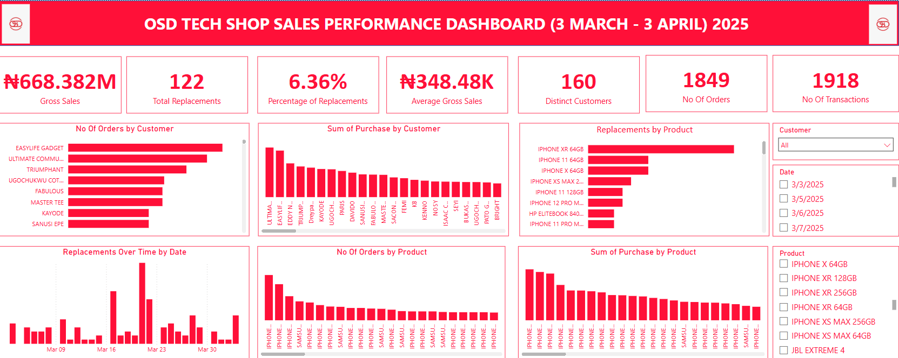

# data-portfolio

Welcome to my Data Analytics Portfolio! This repository serves as a showcase of my data analysis projects and skills. As a Business Data Analyst with almost 3 years of experience, I am committed to continuously expanding this portfolio with new projects.

## Featured Project: OSD Tech Shop Sales Performance Analysis (March 2025)

This initial project focuses on the sales performance of OSD Tech Shop, a retailer specializing in high-end electronic gadgets and PCs. The analysis covers a one-month period (March 3rd to April 3rd, 2025) and aims to provide a comprehensive overview of key sales metrics, product performance, and customer behavior.

**Key areas explored in this analysis include:**

* Overall Gross Sales and Average Gross Sales
* Total Number of Replacements and Percentage of Replacements
* Performance of different product categories (iPhones, Samsung, JBL, PCs, Smartwatches)
* Trends in customer orders and purchasing patterns
* Analysis of product replacements over time

**Visualizations:**

The key findings of this analysis are presented in an interactive dashboard built with Power BI.

*(Please note: The dashboard image is for visual representation.)*

**Tools Used:**

* Busy21 (for data extraction)
* Microsoft Excel (for data cleaning)
* Power BI (for data cleaning and visualization)

---

## Other Projects

*(I am actively working on new data analysis projects, which will be added to this section as they are completed.)*

## Skills

* Data Analysis
* Business Intelligence
* Power BI
* Microsoft Excel
* SQL
* Python

**Connect with me:**

[https://www.linkedin.com/in/christopher-udoka-00520722a/]
[https://www.upwork.com/freelancers/udokac]
[udokachris25@gmail.com]
